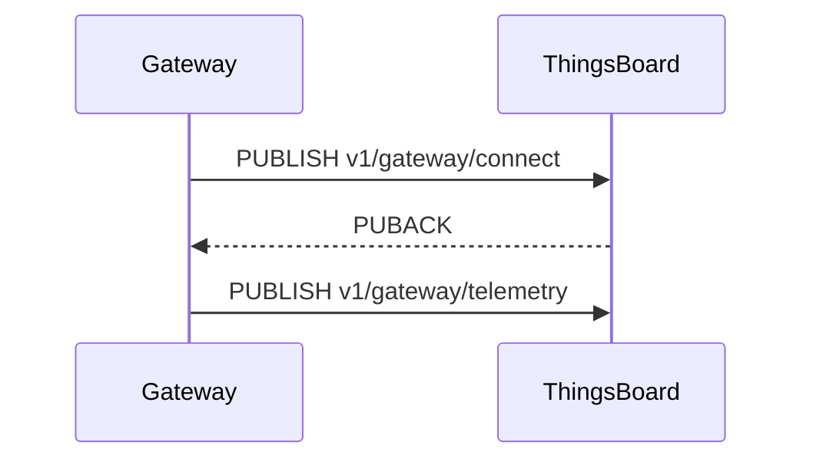

# Edit Doc

## Three-Tier Architecture

Every documentation page requires three files:

```
src/content/_includes/docs/{path}/{page}.mdx   ← ACTUAL CONTENT (shared between CE and PE)
src/content/docs/docs/{path}/{page}.mdx         ← CE stub
src/content/docs/docs/pe/{path}/{page}.mdx      ← PE stub
```

**Include file** — contains all the real content. Receives `props.product` which is passed down to `<DocLink>` and other product-aware components.

**CE stub** (minimal):
```mdx
---
title: Page Title
description: One-sentence description.
---
import PageComponent from '@includes/docs/{path}/{page}.mdx'
import { Products } from '~/models/site.models'

<PageComponent product={Products.CE}/>
```

**PE stub** — identical but `Products.PE`. Always create both stubs immediately after the include.

---

## Content Authoring Rules

### Imports (always at the top of include files)
```mdx
import DocLink from '@components/DocLink.astro';
import { Steps, Aside } from '@astrojs/starlight/components';
```
Add `Steps` only if the page has numbered procedures. Add `Aside` only if the page has callouts.

### Internal links — always use DocLink
```mdx
<DocLink product={props.product} path='user-guide/devices'>Devices</DocLink>
```
- Path: no leading slash, no trailing slash
- Never use bare markdown `[text](url)` for internal pages
- For not-yet-created pages use `path='TODO'`
- Same-page anchor links (`[text](#anchor)`) are fine in markdown

### Aside types
| Type | When to use |
|------|-------------|
| `tip` | Helpful advice or shortcuts |
| `note` | Additional, non-critical information |
| `caution` | Must know before continuing — risk of data loss or misconfiguration |
| `danger` | Destructive, irreversible action |

### Steps
- Each `<Steps>` item starts with an **imperative verb**: Click, Enter, Select, Go to, Set.
- **Combine two-part UI interactions** into one step:
  - ✅ `Enter the device name and click **Save**.`
  - ✅ `Set the trigger filter and click **Add**.`
  - ❌ Two independent actions in one step: `Configure the profile and restart the service.`
- **Show results** when an action produces a visible change: `Click **Save**. The device appears in the list.`
- Use "To + infinitive" only when context is non-obvious:
  - ✅ `To add a new device, go to **Entities > Devices**.`
  - ❌ `To save your changes, click **Save**.` (obvious — omit the context)

### Tables
Use tables for: credential types, transport options, field descriptions, protocol comparisons, parameter references. Tables are preferred over bullet lists for structured data.

### Configuration parameters
Always use ENV variable names, never `thingsboard.yml` property names.
- Wrong: `security.claim.allowClaimingByDefault`
- Right: `SECURITY_CLAIM_ALLOW_CLAIMING_BY_DEFAULT`

Look up mappings at https://thingsboard.io/docs/user-guide/install/config/ or check `MEMORY.md` for known mappings.

### Diagrams
Add an ASCII or Mermaid diagram when the topic involves a non-obvious flow: connection lifecycle, message routing, state machine, data pipeline, entity hierarchy. A diagram replaces several paragraphs of prose for these cases.

Example (Mermaid sequence):
```

```

---

## Rules for _includes

- Never use markdown tables inside `{...}` JSX expressions — use HTML `<table>` instead (MDX parses markdown only inside JSX angle-bracket tags, not curly braces)
- Never use fenced code blocks (`` ``` ``) inside `{...}` JSX expressions — `${...}` inside the block is parsed as a JSX expression and the build fails. Use `<pre><code>{'content with ${literal} dollar braces'}</code></pre>` instead, where the content is a JS string literal so `${...}` is treated as plain text
- Never use `<Steps>` with a markdown numbered list inside `{...}` JSX expressions (e.g. `{condition && (<>...<Steps>1. item</Steps>...</>)}`). Inside `{...}`, markdown lists are not compiled to `<ol>` and `<Steps>` receives no child elements, causing a build error. Use explicit `<ol>/<li>` HTML instead:
  ```mdx
  <Steps>
    <ol>
      <li>First step.</li>
      <li>Second step.</li>
    </ol>
  </Steps>
  ```
  Outside of `{...}` JSX expressions (top-level or inside `<ComponentTag>` children), `<Steps>` with a markdown numbered list works normally.
- To render a literal `${varName}` string in MDX text (not as a JS expression), escape the curly braces: `$\{varName\}` — this renders as `${varName}` without any "varName is not defined" build error
- Use `props.product` (not `Astro.props`) inside include files since they receive props as a component
- Conditional blocks: `{props.product === Products.PE && (<>...</>)}` or ternary `{props.product === Products.CE ? <A/> : <B/>}`

---

## ThingsBoard Style Guide

### Core principles

Documentation must be:
- **Concise** — every word earns its place
- **Factual** — no marketing language, no hyperbole
- **Useful** — readers come to solve problems
- **Scannable** — structure matters as much as content

### Banned words and phrases

**Marketing buzzwords** — never use: powerful, robust, seamless, cutting-edge, comprehensive, out-of-the-box, next-generation

**False simplicity** — never use: easy, simple, just, straightforward

**Corporate speak** — never use: solution, leverage, enable you to, utilize

**Empty phrases** — replace with shorter alternatives:
- "in order to" → "to"
- "for example" → "like"
- "e.g." → "like"
- "such as" → "like"
- "and more" → "etc."

### Factual accuracy

Never invent: feature names, API endpoints, configuration parameters, version numbers, code syntax, or performance statistics. If you cannot verify a technical detail:
- Flag it explicitly: *"I cannot verify this claim about [X]. Please confirm."*
- Do not fill gaps with plausible-sounding information.

### Headings

**Format:** Sentence case — first word capitalized, rest lowercase except proper nouns. No period at the end.
- ✅ `Open-source IoT platform`
- ❌ `Open-Source IoT Platform`

**Length:** 5–8 words maximum.

**Depth:** H1 (one per page) → H2 (major sections) → H3 (subsections). **No H4 or deeper.**

**Introductory paragraph:** No "Overview" heading before it. Answer: what is this, what will the reader learn. No marketing language.

### Voice and tone

**Active voice by default:**
- ✅ `ThingsBoard Edge processes data locally.`
- ❌ `Data is processed locally by ThingsBoard Edge.`

Use passive voice only when the actor is unknown/irrelevant, the object matters more than the subject, or describing automatic system behavior:
- ✅ `The data is encrypted in transit.`
- ✅ `If connection is lost, messages are queued automatically.`

**Second person:** Use "you", not "the user".
- ✅ `You can configure the device profile in three steps.`
- ❌ `The user can configure the device profile in three steps.`

**No first-person plural:** Never "we recommend" or "our goal is". Use "ThingsBoard supports…" instead.

**Present tense:**
- ✅ `The device sends telemetry to the cloud.`
- ❌ `The device will send telemetry to the cloud.`

### Punctuation

**Oxford comma always:** Filter, Enrichment, and Transformation

**No em dash** — rewrite using commas, colons, or new sentences:
- ❌ `The Notification Center — accessible from the sidebar — provides tabs for…`
- ✅ `The Notification Center, accessible from the sidebar, provides tabs for…`

**Colons:** Only after a complete sentence introducing a list:
- ✅ `ThingsBoard supports three protocols: MQTT, HTTP, and CoAP.`
- ❌ `The supported protocols are: MQTT, HTTP, and CoAP.`

**Parentheses:** Only for abbreviations on first use or essential inline clarification. Not for examples.
- ✅ `Role-Based Access Control (RBAC) restricts access…`
- ❌ `The rule chain (which processes data) supports…`

### Lists

**Bulleted lists:** For unrelated items, three or more points.

**Numbered lists:** For procedures or priority order only.

**Simple enumeration (bold term + colon):**
- Capitalize items, no period at end.
- ✅ `**Delete:** Remove the Edge instance and all related data.`

**Consistency rules:**
- Parallel grammatical structure across all items.
- Maximum two levels of nesting.
- Start each item with a capital letter.
- End with a period only if the item is a complete sentence.

### Capitalization

**Always capitalize:**
- Product names: ThingsBoard Edge, Community Edition, Professional Edition
- Industry proper nouns: Docker, Java, MQTT, Kafka
- ThingsBoard **roles** when used as proper names: Tenant Administrator, Customer User, System Administrator
- ThingsBoard **entities** when used as proper names: Device, Asset, Rule Chain, Dashboard, Entity View

**Role/entity capitalization rule:**
- ✅ `The Tenant Administrator can manage all resources.` (naming the role)
- ✅ `Create a new Device in the system.` (naming the entity)
- ✅ `A tenant administrator manages resources for their organization.` (describing function, not naming)
- ✅ `Add a new device to your tenant.` (generic reference)

First instance in a sentence = UI reference or proper name (capitalize). Generic/functional reference = lowercase.

**UI elements:** Bold and capitalize when referencing directly.
- ✅ `Click **Add**.`
- ✅ `Go to **Entities > Devices**.`

**Icon-only buttons:** Use tooltip name with optional symbol.
- ✅ `Click **Add** (+).`
- ❌ `Click the "+" button.`

### Numbers

- Spell out zero through nine: `The system supports three protocols.`
- Use numerals for 10 and above: `The dashboard displays 15 sensors.`
- When different types appear together, use numerals for both: `2 gateways and 15 sensors`
- Units: space between number and unit (`100 ms`, `256 MB`), no space for percent (`50%`) or currency (`$10`)

### Examples and enumerations

Use exactly one of these three patterns:

1. **"like" + examples:** `Send commands like temperature setpoints or reboot signals.`
2. **Enumeration + "etc.":** `Supports email, SMS, Slack, Teams, etc.`
3. **Arrow chain for hierarchies:** `Building (Asset) → Floor (Asset) → Thermostat (Device)`

Never use: "for example", "e.g.", "such as", "and more", or parentheses for examples.

### Definition list format

For term/description pairs in bullet lists:

```
- **Term:** Description as a complete sentence with period.
```

- ✅ `- **Delete:** Remove the Edge instance and all related data.`
- ❌ `- **Delete** — removes the Edge instance`

---

## Sidebar Updates

The sidebar is configured in `astro.sidebar.ts`. Reference pages use `referenceItems(prefix)`, user-guide pages use `guideItems(prefix)`.

### Adding items

```ts
{
    label: 'MQTT API',
    items: [
        `${prefix}/mqtt-api/getting-connected`,
        `${prefix}/mqtt-api/telemetry`,
    ],
},
```

### ⚠ Edit tool often fails on this file

The file mixes tab depths. Use a Python replacement script instead of the Edit tool:

```python
python3 - << 'PYEOF'
with open('astro.sidebar.ts', 'r') as f:
    content = f.read()

old = "...exact string with explicit \\t chars..."
new = "...replacement..."

if old in content:
    content = content.replace(old, new, 1)
    with open('astro.sidebar.ts', 'w') as f:
        f.write(content)
    print("Done")
else:
    # Debug: show actual characters around the target line
    idx = content.find('some-anchor-string')
    print(repr(content[idx-100:idx+100]))
PYEOF
```

Always read the file first to get the exact indentation, and verify with `Read` after editing.

---

## Common Pitfalls

| Problem | Cause | Fix |
|---------|-------|-----|
| `js-yaml` parse error on frontmatter | Description contains a bare colon | Wrap value in double quotes: `description: "Foo: bar"` |
| Edit tool "String not found" in sidebar | Tab/space mismatch | Use Python script with explicit `\t` characters |
| Broken internal link | Bare markdown link used instead of `<DocLink>` | Replace with `<DocLink product={props.product} path='...'>` |
| DocLink path broken | Leading or trailing slash in path | Use `path='reference/foo/bar'` not `path='/reference/foo/bar/'` |
| Config param not found in docs | Used `thingsboard.yml` key | Look up ENV name at the config reference page |
| PE page missing | Forgot to create `pe/` mirror stub | Always create CE + PE stubs together |
| Markdown table inside JSX expression | MDX parses markdown only in angle-bracket tags | Use HTML `<table>` inside `{...}` curly-brace expressions |
| H4 heading in content | Violates "no H4 or deeper" rule | Restructure: flatten to H3 or convert to a table/list |
| Em dash in prose | Banned punctuation | Rewrite using a comma, colon, or new sentence |
| "e.g." or "for example" in text | Banned phrasing | Replace with "like" |
| Role name lowercase when naming role | Capitalization rule | "Tenant Administrator", "System Administrator" when used as proper names |

---

## Component Reference

### DocLink

`src/components/DocLink.astro` — generates a product-aware internal link.

```mdx
import DocLink from '@components/DocLink.astro';

<DocLink product={props.product} path="user-guide/devices">Devices</DocLink>
```

Renders as `<a href="/docs/pe/user-guide/devices/"><b>Devices</b></a>` for PE, `/docs/user-guide/devices/` for CE, etc.

Props: `product` (required), `path` (required, without trailing slash), `bold` (default `true`), `target`.

### ImageGallery

`src/components/ImageGallery.astro` — responsive image grid with a built-in lightbox.

**Features:**
- **Single image mode**: 1 image renders as a centered clickable figure (zoom-in cursor, opens lightbox)
- **Multi image mode**: thumbnail grid (3 columns desktop, 2 on mobile)
- Lightbox with zoom-from-thumbnail open/close animation, Prev/Next + arrow keys, Escape to close
- Caption shown as tooltip on thumbnail hover; in lightbox as a fixed pill at viewport bottom
- Images processed at build time via `astro:assets` → optimized WebP (thumb: 800px/80q, full: 90q)
- **SVGs bypass processing** — served as raw src, no WebP conversion. In lightbox, SVGs scale to fill `90vw × 78vh`
- Supports `.png`, `.jpg`, `.jpeg`, `.webp`, `.gif`, `.svg`

**Props:**

```ts
interface ImageItem {
  src: string;           // Absolute path from project root, e.g. /src/assets/images/foo.png
  alt: string;           // Required alt text
  caption?: string;      // Optional caption (HTML allowed); shown as tooltip and in lightbox
  products?: Products[]; // If set, include this image only when current product is in the list
}

interface Props {
  images: ImageItem[];
  product?: Products;    // Enables product suffix resolution and per-image product filtering
}
```

**Important:** Images must live inside `/src/assets/` — the component uses `import.meta.glob` over that directory only.

#### Product suffix resolution

When `product` is passed, the component automatically resolves product-specific image files. For a given `src`, it tries `{base}-{suffix}{ext}` first, then falls back to the base file. CE is the default product — no suffix (the base file IS the CE file).

**Suffix mapping:** CE → `ce`, PE → `pe`, PAAS → `paas`, PAAS_EU → `paas-eu`, EDGE → `edge`, EDGE_PE → `edge-pe`, GW → `gw`, TRENDZ → `trendz`, MOBILE → `mobile`, MOBILE_PE → `mobile-pe`, TBMQ → `tbmq`, TBMQ_PE → `tbmq-pe`, LICENSE → `license`.

#### Dark theme variant resolution

The component automatically detects and uses dark-mode image variants. For each image, it checks (most specific → least specific):

1. `{base}-{product}-dark{ext}` — product + dark
2. `{base}-dark{ext}` — generic dark
3. Falls back to the light variant

If any image has a dark variant, the component renders both `` elements and toggles visibility via CSS `[data-theme='dark']`. No extra props needed — just place a `-dark` suffixed file alongside the light version.

**Example:** `schema.svg` + `schema-dark.svg` → light/dark switching is automatic.

#### Usage in MDX

```mdx
import ImageGallery from '~/components/ImageGallery.astro';

<ImageGallery images={[
  {
    src: '/src/assets/images/dashboard-overview.png',
    alt: 'Dashboard overview',
    caption: 'Main dashboard with live telemetry',
  },
  {
    src: '/src/assets/images/device-list.png',
    alt: 'Device list',
    caption: 'Filtered device list view',
  },
]} />
```

**With product resolution (in `_includes` files):**

```mdx
<ImageGallery product={props.product} images={[
  { src: '/src/assets/images/guide/step-1.png', alt: 'Step 1' },
  { src: '/src/assets/images/guide/step-2.png', alt: 'Step 2', products: [Products.PE] },
]} />
```

**Conditional rendering (PE/CE) — use HTML `<table>` inside JSX expressions, not markdown tables:**

```mdx
{props.product === Products.PE && (
  <ImageGallery images={[
    { src: '/src/assets/images/pe-feature.png', alt: 'PE feature', caption: 'PE only' },
  ]} />
)}
```

### MultiProductImageGallery

`src/components/MultiProductImageGallery.astro` — thin wrapper around `ImageGallery` that automatically appends a product suffix (`-ce`, `-pe`, `-paas`, etc.) to each image `src` before the file extension.

**When to use:** Any time the same screenshot set exists for multiple products with identical alt text and captions, differing only by a `-ce`/`-pe`/`-paas` filename suffix. Replaces duplicated `{props.product === Products.CE && (...)}` / `{props.product === Products.PE && (...)}` blocks.

**Props:**

```ts
interface ImageItem {
  src: string;           // Base path WITHOUT product suffix, e.g. /src/assets/images/guide/step-1.png
  alt: string;           // Required alt text
  caption?: string;      // Optional caption
  products?: Products[]; // If set, include this image only for the listed products
}

interface Props {
  images: ImageItem[];
  product: Products;     // Current product — determines the suffix
}
```

**Suffix mapping:** CE → `-ce`, PE → `-pe`, PAAS → `-paas`, PAAS_EU → `-paas-eu`, EDGE → `-edge`, EDGE_PE → `-edge-pe`, GW → `-gw`, TRENDZ → `-trendz`, MOBILE → `-mobile`, MOBILE_PE → `-mobile-pe`, TBMQ → `-tbmq`, TBMQ_PE → `-tbmq-pe`, LICENSE → `-license`.

**Example:** `src="/src/assets/images/guide/step-1.png"` with `product=PE` resolves to `/src/assets/images/guide/step-1-pe.png`.

**Usage in MDX (include files):**

```mdx
import MultiProductImageGallery from '~/components/MultiProductImageGallery.astro';
import { Products } from '~/models/site.models';

{/* All images shared across products — same alt/caption, auto-suffixed src */}
<MultiProductImageGallery product={props.product} images={[
  { src: '/src/assets/images/guide/step-1.png', alt: 'Step 1', caption: 'First step.' },
  { src: '/src/assets/images/guide/step-2.png', alt: 'Step 2', caption: 'Second step.' },
]} />

{/* Mixed: shared images + product-specific images */}
<MultiProductImageGallery product={props.product} images={[
  { src: '/src/assets/images/guide/step-1.png', alt: 'Step 1', caption: 'Shared step.' },
  { src: '/src/assets/images/guide/step-2-ce-only.png', alt: 'CE result', caption: 'CE only.', products: [Products.CE] },
  { src: '/src/assets/images/guide/step-2-pe-only.png', alt: 'PE result', caption: 'PE only.', products: [Products.PE] },
]} />
```

**Important:** The actual image files on disk must include the product suffix (e.g., `step-1-ce.png`, `step-1-pe.png`). The `src` prop in MDX is the base name without the suffix.

### DocImage

`src/components/DocImage.astro` — single optimized image with optional width and alignment.

**Features:**
- Images processed at build time via `astro:assets` → WebP at quality 85
- Numeric `width` resizes the image via `getImage`; string `width` (e.g. `"50%"`) applies as CSS `max-width`
- `align` controls horizontal positioning (`left` / `center` / `right`); default is `center`
- Row layout: wrap multiple `DocImage` in `<div class="doc-image-row">` for side-by-side display; stacks to 100% on ≤640px
- Supports `.png`, `.jpg`, `.jpeg`, `.webp`, `.gif`

**Props:**

```ts
interface Props {
  src: string;                         // Absolute path from project root, e.g. /src/assets/images/foo.png
  alt: string;                         // Required alt text
  width?: number | string;             // number → resize (px); string → CSS max-width (e.g. "50%", "400px")
  align?: 'left' | 'center' | 'right'; // Default: 'center'
}
```

**Important:** Images must live inside `/src/assets/` — the component uses `import.meta.glob` over that directory only.

**Usage in MDX:**

```mdx
import DocImage from '~/components/DocImage.astro';

{/* Basic — centered, full width */}
<DocImage src="/src/assets/images/diagram.png" alt="System diagram" />

{/* Constrained width, centered */}
<DocImage src="/src/assets/images/diagram.png" alt="System diagram" width="60%" />

{/* Pixel resize (passed to getImage) */}
<DocImage src="/src/assets/images/diagram.png" alt="System diagram" width={800} />

{/* Alignment */}
<DocImage src="/src/assets/images/diagram.png" alt="System diagram" width="50%" align="left" />
<DocImage src="/src/assets/images/diagram.png" alt="System diagram" width="50%" align="right" />
```

**Row layout — two or more images side by side:**

```mdx
<div class="doc-image-row">
  <DocImage src="/src/assets/images/step-1.png" alt="Step 1" />
  <DocImage src="/src/assets/images/step-2.png" alt="Step 2" />
  <DocImage src="/src/assets/images/step-3.png" alt="Step 3" />
</div>
```

Images inside `.doc-image-row` share equal width (`flex: 1`) and stack vertically on screens ≤640px. The `.doc-image-row` styles are defined inside `DocImage.astro` via `:global()` and are available on any page that renders a `DocImage`.

### Banner

`src/components/Banner.astro` — unified banner component replacing the former `PEFeatureBanner` and `InfoBanner`.

**Variants:**

| `variant` | Color | Behavior |
|-----------|-------|----------|
| `peFeature` | `--color-product-pe` (green) | Renders **only on CE pages** (`product === Products.CE`). Shows standard text: "This feature is available in ThingsBoard Professional and ThingsBoard Cloud only." with links. Accepts optional extra slot content. |
| `ce` | `--color-product-ce` (blue-gray) | Always renders; slot content only. |
| `pe` | `--color-product-pe` (green) | Always renders; slot content only. |
| `cloud` | `--color-product-cloud` (blue) | Always renders; slot content only. |
| `trendz` | `--color-product-trendz` (light blue) | Always renders; slot content only. |

Non-`peFeature` variants render as `inline-block` / `width: fit-content` (shrinks to content width).

**Props:**

```ts
interface Props {
  variant: 'peFeature' | 'ce' | 'pe' | 'cloud' | 'trendz';
  product?: Products;  // Required for variant='peFeature'
  path?: string;       // For 'peFeature': path to docs page for PE/Cloud links (default: 'installation')
}
```

**Usage in MDX `_includes`:**

```mdx
import Banner from '~/components/Banner.astro';

{/* PE/Cloud-only feature notice — renders only on CE */}
<Banner variant="peFeature" product={props.product} path="user-guide/reporting/getting-started" />

{/* Informational note with cloud accent */}
<Banner variant="cloud">This action type is available for <DocLink product={props.product} path="user-guide/widgets/map-widgets">Map widgets</DocLink> only.</Banner>

{/* CE-colored note */}
<Banner variant="ce">Some CE-specific note here.</Banner>
```

**When to use:** Use `variant="peFeature"` at the top of any include file for a PE/Cloud-only feature. Use the other variants for informational scope notes that apply to all editions. Do NOT use `<Aside type="note">` for these purposes.

### Badge & tb-badge

`src/components/Badge.astro` — thin wrapper around Starlight's `<Badge>` with custom styles.

#### tb-badge

A text-only accent badge: no border, no background, `--sl-color-text-accent` color, `font-weight: 600`, `vertical-align: top`.

**Styles defined in** `src/components/Badge.astro` via `<style is:global>`:

| Class | Size |
|-------|------|
| `.tb-badge` (default, `size="small"`) | 0.75rem (12px) |
| `.tb-badge` + `size="medium"` | 0.875rem (14px) |

**Usage in MDX:**

```mdx
import Badge from '~/components/Badge.astro';

{/* 12px — default */}
<Badge text="NEW" class="tb-badge" />

{/* 14px */}
<Badge text="NEW" class="tb-badge" size="medium" />
```

**Active sidebar item** — when the parent link has `aria-current="page"`, `.tb-badge` inherits the link's text color (avoids invisible badge on accent background).

#### Where to configure the badge

| Goal | Where to configure |
|------|--------------------|
| Badge **only in sidebar** (link or group) | `astro.sidebar.ts` only |
| Badge **on page title AND sidebar** | page frontmatter `sidebar.badge` only |

**Sidebar only** — configure in `astro.sidebar.ts`, do NOT add `sidebar.badge` to the page frontmatter:

```ts
// single page link
{ slug: 'docs/concepts/data-visualization', badge: { text: 'NEW', class: 'tb-badge' } }

// group label
{
  label: 'Key concepts',
  badge: { text: 'NEW', class: 'tb-badge' },
  items: [...],
}
```

**Page title + sidebar** — add `sidebar.badge` to the page frontmatter. The custom `PageTitle.astro` reads this field and renders the badge next to `<h1>` at `size="medium"`. No changes to `astro.sidebar.ts` needed — Starlight automatically picks up `sidebar.badge` from frontmatter and shows it on the sidebar link too:

```yaml
---
title: My Page
sidebar:
  badge:
    text: NEW
    class: tb-badge
---
```

- `text` — badge label (required)
- `variant` — `default` | `note` | `tip` | `caution` | `danger` | `success` (optional, default: `default`)
- `class` — CSS class, use `tb-badge` for the text-only style

### YouTubeVideo

`src/components/YouTubeVideo.astro` — responsive YouTube video embed that fills the full content width.

**Props:**

```ts
interface Props {
  videoId: string;  // YouTube video ID, e.g. '3xRWm1W1IM4'
  title?: string;   // Accessible iframe title (default: 'YouTube video')
}
```

**Usage in MDX:**

```mdx
import YouTubeVideo from '~/components/YouTubeVideo.astro';

<YouTubeVideo videoId="3xRWm1W1IM4" title="ThingsBoard overview" />
```

### ConditionalHeading

`src/components/ConditionalHeading.astro` — renders a heading with the full Starlight anchor-link structure (`sl-heading-wrapper` + `sl-anchor-link`) for use inside JSX conditional expressions in `_includes` files.

**The problem it solves:** Headings inside `{...}` JSX expressions (`{condition && (<><h3>...</h3></>)}`) are invisible to Starlight's TOC and don't get anchor icons. A markdown `### heading` inside `{...}` renders as plain text. `ConditionalHeading` provides a heading that:
- Renders the correct HTML structure (identical to what Starlight generates for markdown headings)
- Gets picked up by `rehype-mdx-include-headings` plugin and injected into the TOC **only for matching products**
- Has a working anchor link (explicit `id` prop)

**Props:**

```ts
interface Props {
  level?: 2 | 3 | 4 | 5 | 6;  // heading level, default 3
  id: string;                   // anchor id, e.g. "export-dashboard" (required)
  exclude?: string;             // comma-separated product ids to EXCLUDE (plugin only)
  showFor?: string;             // comma-separated product ids to INCLUDE (plugin only)
}
```

`exclude` and `showFor` are parsed by the `rehype-mdx-include-headings` plugin from raw MDX source — they are not used in rendering.

**Product ids** (for `exclude`/`showFor`): `ce`, `pe`, `paas`, `paas-eu`, `edge`, `edge-pe`, `trendz`, `iot-gateway`, `mqtt-broker`, `mqtt-broker-pe`, `mobile`, `mobile-pe`, `license-server`.

**Usage in MDX `_includes`:**

```mdx
import ConditionalHeading from '~/components/ConditionalHeading.astro';

{props.product !== Products.CE && (
  <>
    <ConditionalHeading level={3} id="export-dashboard" exclude="ce">Export dashboard</ConditionalHeading>

    Content visible only for non-CE products...
  </>
)}
```

**TOC level rules** — the `level` value determines where the heading appears in the right sidebar:
- `level={2}` → same indentation as `##` headings (top level)
- `level={3}` → nested under the previous `##` heading (same visual level as `####` siblings due to `injectChild` algorithm — use `level={2}` for top-level placement)
- `level={4}` → nested one level deeper

**How it works:** The `rehype-mdx-include-headings` plugin (`config/plugins/rehype-mdx-include-headings.ts`):
1. Determines the current page's product from its file path (`src/content/docs/docs/pe/...` → `pe`)
2. Skips `### markdown` headings inside `{...}` JSX blocks (they render as plain text anyway)
3. Parses `<ConditionalHeading>` tags and injects the heading into the TOC only when the page product matches `exclude`/`showFor`

**Important:** If the dev server doesn't pick up a change to `level` or `id` inside an include file, restart it (`pnpm dev`) — hot-reload may miss include file changes when only the include (not the page file) is modified.

### InstallationCardGrid

`src/components/InstallationCardGrid.astro` — responsive card grid for installation option pages.

**Features:**
- 3-column grid (2 on tablet ≤900px, 1 on mobile ≤480px)
- When exactly **2 cards** are passed, the grid switches to 2 columns so both cards fill the full width
- SVGs loaded as raw inline HTML (`?raw`) so CSS custom properties (e.g. `fill="var(--sl-color-white)"`) work correctly
- Three `path` modes: relative doc path, absolute URL, or omitted (→ "Coming soon")
- "Coming soon" cards render as a non-clickable `<div>`, `opacity: 0.5`, no hover, auto badge "Coming soon"
- Optional Starlight `<Badge>` positioned absolutely in the top-right corner (`top/right: 1.5rem`) inside the link
- Accent glow blob in the top-right corner via `--landing-card-accent`

**Props (`CardItem`):**

```ts
interface CardItem {
  path?: string;        // Relative: 'installation/docker' → /docs/{prefix}installation/docker/
                        // Absolute: 'https://...' → used as-is
                        // Omitted  → Coming soon (non-clickable card)
  title: string;
  icon: string;         // SVG path inside /src/assets/, e.g. '/src/assets/images/installation/ubuntu.svg'
  accent?: string;      // CSS color for the glow blob, e.g. '#e63946'
  target?: string;      // e.g. '_blank'
  badge?: string;       // Badge label, e.g. 'NEW'
  badgeVariant?: 'default' | 'note' | 'tip' | 'caution' | 'danger' | 'success';
}
```

**Important:** `icon` paths must be inside `/src/assets/` — the component uses `import.meta.glob` with `?raw` over that directory only.

**Usage in MDX:**

```mdx
import InstallationCardGrid from '~/components/InstallationCardGrid.astro';
import { Products } from '~/models/site.models';

<InstallationCardGrid product={props.product} items={[
  {
    path: 'installation/ubuntu',
    title: 'Ubuntu',
    icon: '/src/assets/images/installation/ubuntu.svg',
    accent: '#e95420',
  },
  {
    path: 'https://thingsboard.cloud/signup',
    title: 'ThingsBoard Cloud',
    icon: '/src/assets/images/installation/trendz-cloud.svg',
    target: '_blank',
    badge: 'FREE',
    badgeVariant: 'tip',
  },
  {
    title: 'OpenShift',
    icon: '/src/assets/images/installation/open-shift.svg',
    // no path → Coming soon
  },
]} />
```

### RuleNodeCardGrid

`src/components/RuleNodeCardGrid.astro` — responsive card grid for rule node category overviews.

**Features:**
- 3-column grid (2 on tablet ≤900px, 1 on mobile ≤480px)
- Each card links to an anchor section on the page
- Image area (16:9): shows an optimised raster screenshot, or a grid-background placeholder with a centered SVG icon
- SVG icon scales to 1.2× on card hover
- Optional Starlight `<Badge>` in the top-right corner of the image area
- Raster images processed at build time → WebP 480px/85q via `astro:assets`
- SVGs resolved via a separate `import.meta.glob` (not processed, served as-is)

**Props (`CardItem`):**

```ts
interface CardItem {
  title: string;
  href: string;
  description: string;
  image?: string;       // Raster image path inside /src/assets/ (png/jpg/webp/gif)
  icon?: string;        // SVG path inside /src/assets/ — shown in placeholder when no image
  alt?: string;         // Alt text for image; falls back to title
  badge?: string;       // Badge label in top-right corner of image area
  badgeVariant?: 'default' | 'note' | 'tip' | 'caution' | 'danger' | 'success';
}
```

**Important:** Both `image` and `icon` paths must be inside `/src/assets/` — the component uses `import.meta.glob` over that directory only.

**Usage in MDX:**

```mdx
import RuleNodeCardGrid from '~/components/RuleNodeCardGrid.astro';

<RuleNodeCardGrid items={[
  {
    href: '#filter-nodes',
    title: 'Filter',
    description: 'Route messages based on conditions — no data modification',
    icon: '/src/assets/images/user-guide/rule-nodes/node-filter.svg',
  },
  {
    href: '#analytics-nodes',
    title: 'Analytics',
    description: 'Aggregate data streams and compute statistics',
    icon: '/src/assets/images/user-guide/rule-nodes/node-analytics.svg',
    badge: 'PE only',
    badgeVariant: 'success',
  },
]} />
```

### Code Blocks

#### Meta options

`config/plugins/expressive-code-max-lines.mjs` — custom Expressive Code plugin that adds independent meta options to fenced code blocks.

| Option | Type | Description |
|--------|------|-------------|
| `maxLines=N` | number | Limits the visible height to N lines; enables vertical scroll when content overflows |
| `collapsible` | boolean flag | Adds an ▼ Expand / ▲ Collapse button below the block (requires `maxLines`) |
| `wrap` | boolean flag | Wraps long lines instead of horizontal scroll; copy button copies original text unchanged |
| `download='file.ext'` | string | Adds a download button (↓ icon) next to the copy button; clicking it saves the code content as a file with the given filename |

`maxLines` and `collapsible` are independent — `maxLines` alone gives a scrollable block without a button; adding `collapsible` enables the toggle. `wrap` can be used alone or combined with `maxLines`. `download` can be combined with any other option.

**Usage in MDX fenced code blocks:**

````
```js maxLines=15
// height-limited + scrollable, no expand/collapse button
```

```js maxLines=15 collapsible
// height-limited + scrollable + Expand/Collapse button
```

```js maxLines=15 collapsible title="script.js"
// can be combined with other EC meta options
```

```bash wrap
// long lines wrap visually; copy button copies the original single-line text
```

```bash wrap maxLines=5
// wrap + maxLines can be combined
```

```json download='config.json'
// download button appears next to the copy button; saves code as config.json
```

```yml download='docker-compose.yml' maxLines=30 collapsible
// download can be combined with other meta options
```
````

**`download` notes:**
- The filename value must use single quotes: `download='file.ext'`
- The button uses an inline SVG download icon (↓ arrow) and matches the EC copy button size
- On click: reads the raw code from the EC copy button's `data-code` attribute, creates a `Blob`, and triggers a browser download with the specified filename
- Works inside `<Tabs>` / `<TabItem>` — re-initializes when a hidden tab panel becomes visible
- Also supported via the `<Code>` component: `<Code code={snippet} lang="json" meta="download='config.json'" />`

**Implementation notes:**
- Plugins registered in `ec.config.mjs` (project root) — **not** in `astro.config.ts`. This separate file is required for the `<Code>` component to work alongside custom plugins.
- HAST uses `properties.className` (array), not `properties.class` — the plugin uses a local `appendClassName` helper
- Data attribute stored as `dataMaxLines` in HAST properties → rendered as `data-max-lines` in HTML → read as `el.dataset.maxLines` in JS
- Hook order: `pluginFrames` wraps `blockAst` in `<figure.frame>` before our hook runs, so `renderData.blockAst` is already the final `<figure>`
- The plugin file is `.mjs` (not `.ts`) because `ec.config.mjs` is executed directly by Node.js on CI without Vite — TypeScript extensions cause `ERR_UNKNOWN_FILE_EXTENSION`

#### Tabbed Code Blocks

For multiple files shown as tabs, use Starlight's `<Tabs>` and `<TabItem>` from `@astrojs/starlight/components`. Fenced code blocks (including EC meta options) work correctly inside `<TabItem>` in MDX.

**Usage in MDX:**

````mdx
import { Tabs, TabItem } from '@astrojs/starlight/components';

<Tabs>
<TabItem label="decoder.js">
```js maxLines=15 collapsible
// decoder code
```
</TabItem>
<TabItem label="encoder.js">
```js maxLines=15 collapsible
// encoder code
```
</TabItem>
</Tabs>
````

**Note:** IDE diagnostics may show false `} expected` errors for curly braces inside fenced code blocks within `<TabItem>`. These are TypeScript language server noise — the MDX compiler handles them correctly.

#### `<Code>` component vs fenced blocks

Both approaches use Expressive Code under the hood and support the same meta options.

**When to use each:**
- **Fenced block** ` ``` ` — static code, preferred in most cases, cleaner syntax
- **`<Code>` component** — when the code string comes from a variable or needs to be passed as a prop

**`<Code>` component usage:**

```mdx
import { Code } from '@astrojs/starlight/components';

{/* Inline string — use template literal to avoid JSX curly-brace conflicts */}
<Code code={`var result = {};
return result;`} lang="js" title="script.js" />

{/* From a variable — preferred for long code */}
export const snippet = `
var data = decodeToJson(payload);
var result = { telemetry: {} };
return result;
`;

<Code code={snippet} lang="js" title="decoder.js" meta="maxLines=15 collapsible" />
```

**`<Code>` props:**

| Prop | Type | Description |
|------|------|-------------|
| `code` | `string` | The code to display (required) |
| `lang` | `string` | Language for syntax highlighting |
| `title` | `string` | Filename shown in the frame tab |
| `mark` | `string` | Lines to highlight, e.g. `"{3,5-7}"` |
| `ins` | `string` | Lines to mark green (inserted) |
| `del` | `string` | Lines to mark red (deleted) |
| `meta` | `string` | Raw meta string — pass any EC options including custom ones: `"maxLines=15 collapsible"` |
| `frame` | `string` | Frame style: `auto` (default), `code`, `terminal`, `none` |

**Tabbed `<Code>` blocks — same `<Tabs>` + `<TabItem>` wrapper:**

````mdx
import { Tabs, TabItem } from '@astrojs/starlight/components';
import { Code } from '@astrojs/starlight/components';

<Tabs>
<TabItem label="decoder.js">
  <Code code={decoderSnippet} lang="js" meta="maxLines=15 collapsible" />
</TabItem>
<TabItem label="encoder.js">
  <Code code={encoderSnippet} lang="js" meta="maxLines=15 collapsible" />
</TabItem>
</Tabs>
````

**Supported `lang` values (Shiki):**

| Category | Values |
|----------|--------|
| JavaScript / TypeScript | `js`, `javascript`, `ts`, `typescript`, `jsx`, `tsx` |
| JVM | `java`, `kotlin`, `groovy`, `scala` |
| Systems | `c`, `cpp`, `csharp`, `cs`, `rust`, `go` |
| Scripting | `python`, `ruby`, `php`, `bash`, `sh`, `shell`, `powershell` |
| Data / Config | `json`, `json5`, `yaml`, `yml`, `toml`, `ini`, `properties`, `xml` |
| Web | `html`, `css`, `scss`, `graphql`, `sql` |
| DevOps | `dockerfile`, `docker`, `nginx`, `terraform` |
| Docs / Other | `markdown`, `md`, `mdx`, `plaintext`, `txt` |
| Mobile | `swift`, `dart`, `objc` |
| Other | `proto`, `r`, `matlab`, `lua` |

Full list: [shiki.style/languages](https://shiki.style/languages). Use `plaintext` or omit `lang` entirely for no syntax highlighting.

### Version Constants

`src/data/versions.ts` — centralized product version strings. **Never hardcode version strings** in Docker image tags, download URLs, or code blocks.

```ts
import { CE_FULL_VER } from '~/data/versions';        // '4.3.0.1'
import { PE_FULL_VER, TRENDZ_VER } from '~/data/versions';  // '4.3.0.1PE', '1.15.0.4'
```

Available: `CE_FULL_VER`, `PE_FULL_VER`, `TRENDZ_VER`, `EDGE_VER`, `EDGE_PE_VER`, `TBMQ_VER`, `TBMQ_PE_VER`.

To interpolate versions into code blocks, use the `<Code>` component with exported string constants:

```mdx
import { Code } from '@astrojs/starlight/components';
import { CE_FULL_VER } from '~/data/versions';

export const yamlContent = `services:
  thingsboard:
    image: "thingsboard/tb-node:${CE_FULL_VER}"`;

<Code code={yamlContent} lang="yml" meta="maxLines=20 collapsible" />
```

### Static Files (public/)

Files that must be served as-is (not processed by the build) go in the `public/` directory. They are copied to `dist/` preserving the path structure, and are available at the root URL.

**Use `public/` for:**
- JSON files available for download
- PDFs or other binary assets linked from docs
- Any file referenced by a direct URL (not via `astro:assets`)

**Do NOT put these in `src/assets/`** — that directory is for images processed via `astro:assets` (optimization, format conversion).

**Example — downloadable JSON:**

File location: `public/resources/airconditioners_dashboard.json`

Link in MDX:
```html
<a href="/resources/airconditioners_dashboard.json" download="airconditioners_dashboard.json">
  airconditioners_dashboard.json
</a>
```
